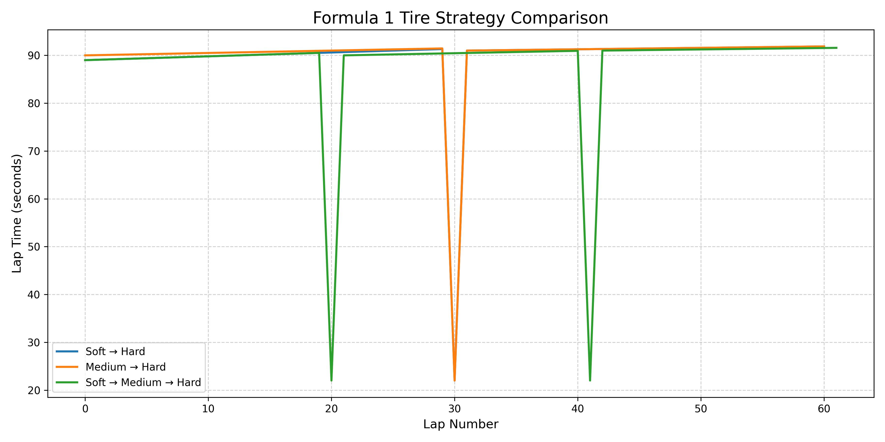

# F1 Strategy Simulator

A Python-based Formula 1 race strategy simulator that compares different tire strategies over a 60-lap race using tire degradation models and pit stop time losses.

## Project Overview

This project simulates how different tire compounds affect race strategy. It models lap-by-lap performance, tire degradation, pit stop penalties, and total race time to compare multiple race strategies.

The simulator currently compares:
- __Soft → Hard__
- __Medium → Hard__
- __Soft → Medium → Hard__

After running the simulation, the program determines the fastest strategy and displays a graph of lap times throughout the race.

The program compares:
- A __1-stop strategy__
- A __2-stop strategy__

and visualizes lap times using graphs.

---

## Features

- Simulates a full 60-lap Formula 1 race
- Models three tire compounds
- Simulates tire degradation
- Includes pit stop time penalties
- Calculates total race time for each strategy
- Automatically determines the winning strategy
- Visualizes lap-by-lap performance using Matplotlib

---

## Tire Model

The simulator models three Formula 1 tire compounds, each with different performance characteristics.

| Tire Compound | Base Lap Time | Tire Degradation |
|---------------|---------------|------------------|
| Soft | 89.0 seconds | +0.08 sec/lap |
| Medium | 90.0 seconds | +0.05 sec/lap |
| Hard | 91.0 seconds | +0.03 sec/lap |

### Assumptions

- Tire degradation increases lap time every lap.
- Pit stop time loss is fixed at **22 seconds**.
- Each pit stop resets tire degradation.
- The race distance is **60 laps**.

The Soft tire provides the fastest initial pace but degrades quickly. The Hard tire is slower initially but maintains its performance over longer stints. The Medium tire provides a balance between speed and durability.

---

## Technologies Used

- Python
- Matplotlib

---

## Example Output

```text
Race Results
------------------------------
Soft -> Hard: 5469.85 seconds
Medium -> Hard: 5486.80 seconds
Soft -> Medium -> Hard: 5474.40 seconds

Winning Strategy:
Soft -> Hard wins!
```
---

## Strategy Comparison Graph



---

## Future Improvements

Planned features include:

- Random Safety Car periods
- Variable weather conditions
- Fuel load simulation
- Multiple put stop timing optimization
- Read Formula 1 telemetry data
- Interactive user input for custom strategies

---

## Skills Demonstrated

This Project demonstrates: 

- Python programming
- Simulation modeling
- Data visualization
- Algorithm design
- Problem-solving
- Motorsport analytics
- Software development using Git and GitHub